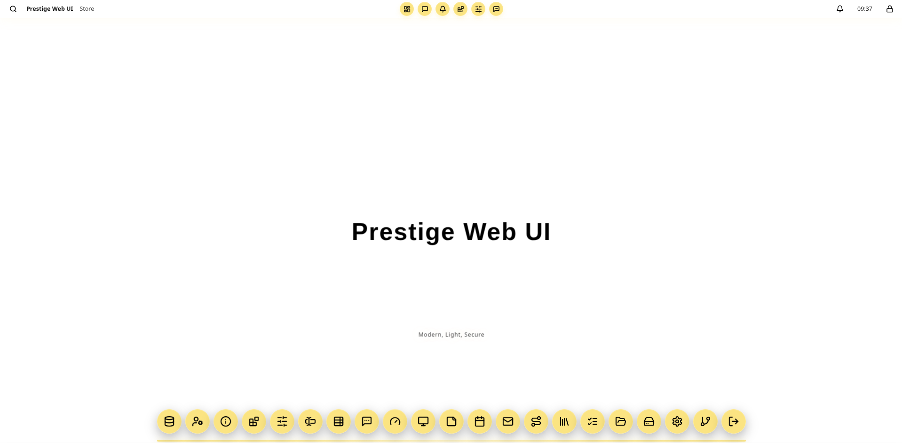

<p align="center">
  
</p>

<h1 align="center">Prestige Web UI</h1>

<p align="center">
  <a href="https://eng-aliKazemi.github.io/Prestige-Web-UI/"><strong>🌐 Prestige Web Ui Official Website</strong></a>
</p>

<p align="center">
  <strong>A Prestigious User Interface For Prestigious Users</strong>
</p>

<p align="center">
  
  
  
  
  
</p>

---

## 📑 Table of Contents

- [Introduction](#introduction)
- [Architecture &amp; Innovation](#architecture--innovation)
- [Architecture Decision Records (ADRs)](#architecture-decision-records-adrs)
- [Features](#features)
- [TypeScript](#typescript)
- [Memory Engine](#memory-engine)
- [GPU Rendering Engine](#gpu-rendering-engine)
- [Security](#security)
- [Web3 Foundations](#web3-foundations)
- [How to Use](#how-to-use)
- [AI Coding Assistants](#ai-coding-assistants)
- [Request for Testing & Feedback](#request-for-testing--feedback)
- [How to Contribute](#how-to-contribute)
- [Acknowledgments](#acknowledgments)
- [Code of Conduct](#code-of-conduct)
- [Commercial Development & Enterprise Support](#commercial-development--enterprise-support)
- [Contact & Inquiries](#contact--inquiries)

---

## 🚀 Introduction

Prestige Web UI is a modern, professional web user interface designed from a fresh perspective, a different mindset for a different user experience. It is built to provide the familiarity of a desktop with the flexibility of the web, creating experiences that are both visually appealing and highly productive.

It is specifically developed for two purposes:

- **Advanced, feature-rich admin dashboards**, and
- **End-user interfaces** where multiple windows are present and there is a real need to open and manage several windows or pages simultaneously.

Prestige Web UI is used across a variety of **AI/ML projects** where configurability and observability are core requirements for complex workloads. It is designed to be **standalone** and **fully dependency-free**, so it can be integrated into any web or desktop project quickly, with easy customization to produce a wide range of user interfaces.

Prestige Web UI began as an advanced proprietary interface, engineered in **C++** on the **Qt framework** to deliver a high-performance, secure, and visually distinctive commercial user interface. This open-source release re-imagines that heritage for the modern web: the entire shell is authored in strict TypeScript and compiled down to standalone, zero-dependency JavaScript. TypeScript is purely a compile-time tool, what ships is pure vanilla JS + CSS that runs in any browser with a `<script>` tag, with no Node, bundler, or build step required by your users.

Because the shell is **framework- and backend-agnostic**, it embeds seamlessly into any stack:

| Backend / Frontend | How Prestige Web UI fits |
|--------------------|----------------------|
| **Python**, Django, Flask, FastAPI | Include the bundles in your base template and serve window content from your routes |
| **Rust**, Axum, Actix, Rocket | Serve the static bundles and stream window content from your handlers |
| **Go**, net/http, Gin, Echo | Serve the static bundles and stream window content from your handlers |
| **Ruby / PHP**, Rails, Laravel | Drop the shell into a base layout and render window panels from your controllers |
| **Server-rendered HTML**, HTMX, Turbo, LiveView | Drop-in shell; content swaps seamlessly with an automatic loading overlay |
| **SPA / client-side apps** | Import the ESM bundle or use the classic `<script>` drop-in |
| **Static sites / portfolios** | Open `examples/index.html` directly in a browser |

Every color, radius, shadow, and animation is driven by **105+ CSS custom properties**, so re-theming the entire shell is a single-variable change. Every feature is config-driven, disable anything at runtime with a boolean flag.

- **Zero dependencies**, standalone ES6+ JavaScript and modern CSS, no build step at runtime
- **Strict TypeScript**, typed source, hand-written-clean output, full `.d.ts` typings
- **Secure by default**, escaped text, a strict HTML sanitizer, credential guards, and a Web3 transaction guard
- **Production tested**, 178/178 tests, strict typechecks, SRI-hashed release assets, and CI verification

---

## 🏗️ Architecture &amp; Innovation

The codebase is modular by design: focused TypeScript modules under `typescript/src/` (utils, core, ui, types), each with a single responsibility. Extensions register through the component registry or the app manifest rather than touching core internals.

Components are DOM-first: factory functions build real nodes with typed `$tag()`/`$text()` helpers, preserving event handlers and lifecycle ownership, with opt-in HTML parsing for trusted content only. Event delegation, GPU-rendered layers, and transform/opacity-only animations keep the shell fast even with many windows open.

The `Prestige` class is the single entry point; each subsystem lives in its own module with a single responsibility, and the shell reads (and binds to) the existing HTML rather than generating it.

At the top, your host application supplies the shell markup, the menubar, dock, and desktop canvas. The `Prestige` class initializes against this markup and orchestrates the subsystems below it:

- **Window Manager**, dragging, resizing, snap, and browser-cascade behavior for every open window.
- **Dock & Topdock**, launching apps and drag-and-drop reordering of the launch bar.
- **Dialog system**, Promise-based modal variants and toast notifications.
- **Reactive Store**, in-memory signals, an efficient cache, and persistence.
- **Helpers**, icon registry, component builders, memory management, and sanitization.

Every one of these subsystems reads from, and styles itself through, the shared **CSS design token system**, the `--prestige-*` variables that drive all theming.

The build is equally modular, compiling TypeScript to the ESM/UMD bundles and assembling the CSS with content-hashed, SRI-protected release assets. Consumers never run any of it:

```
typescript/src        css/*.css
  (strict TS)           (9 modules)
      │                      │
      ▼                      ▼
Vite + finalize-umd    scripts/build.py
      │                      │
      ▼                      ▼
dist/prestige.js       dist/prestige.css
dist/prestige.umd.cjs  manifest.json (SRI)
dist/index.d.ts
      │                      │
      └──────────┬───────────┘
                 ▼
     Your web app (script tag / import)
     no Node, bundler, or build step
```

- **Modular**, strict TypeScript sources in `typescript/src/` (utils, core, ui), each with a single responsibility
- **Extensible**, add features via the component registry, `registerApp()`, or `Prestige.mixin()`
- **Themable**, 105+ CSS custom properties drive every color, no hardcoded values
- **Configurable**, 15+ feature flags in the constructor
- **Framework-agnostic**, works with any backend or frontend

---

## 🧭 Architecture Decision Records (ADRs)

Every significant architectural choice behind Prestige Web UI is documented as an **Architecture Decision Record (ADR)** in [`docs/adr/`](docs/adr/). Each ADR explains the **context**, the **decision**, the **consequences**, and the **alternatives considered**, so the *why* survives long after a line of code has moved. ADRs are immutable in intent — a decision is only changed by superseding it with a new one that references the old.

Browse them in any order from the index, [`docs/adr/README.md`](docs/adr/README.md):

| # | ADR | What it decides |
|---|-----|-----------------|
| 0001 | [Standalone vanilla JS from strict TypeScript](docs/adr/0001-standalone-vanilla-js-from-strict-typescript.md) | Zero-dependency output; TypeScript is a compile-time tool only |
| 0002 | [`dist/` is the source of truth](docs/adr/0002-dist-as-source-of-truth.md) | Artifacts are committed; sources are backported before every build |
| 0003 | [UMD finalizer + window helpers](docs/adr/0003-umd-finalizer-window-helpers.md) | Restores the `Prestige` global and `window.*` DOM helpers |
| 0004 | [Modular single-responsibility order](docs/adr/0004-modular-single-responsibility-order.md) | Mandatory build order keeps modules decoupled and merge-safe |
| 0005 | [Config-driven features](docs/adr/0005-config-driven-features.md) | Every feature gated by a constructor boolean, no source forks |
| 0006 | [DOM-first rendering](docs/adr/0006-dom-first-rendering.md) | Real nodes via `$tag()`; `innerHTML` is banned for dynamic content |
| 0007 | [Design-token theming](docs/adr/0007-design-token-theming.md) | 105+ `--prestige-*` variables; zero hardcoded colors outside `tokens.css` |
| 0008 | [Deterministic memory engine](docs/adr/0008-deterministic-memory-engine.md) | `DisposalStack` + `Owned` ownership + secret zeroing |
| 0009 | [Promise-based dialog system](docs/adr/0009-promise-dialog-system.md) | Promise dialogs; native browser dialogs are banned |
| 0010 | [Reactive store + SWR](docs/adr/0010-reactive-store-swr.md) | Signals, cache, URL sync, and a credential guard |
| 0011 | [Security by default](docs/adr/0011-security-by-default.md) | Sanitizer, app-ID validation, URL policy, defense-in-depth |
| 0012 | [Web3 transaction guard](docs/adr/0012-web3-transaction-guard.md) | Isolation, tamper-detection, clickjacking defense, `bigint` |
| 0013 | [GPU compositing layer](docs/adr/0013-gpu-compositing.md) | Smooth 60 fps multi-window motion off the main thread |
| 0014 | [Window physics](docs/adr/0014-window-physics.md) | Cascade, drag, resize, magnet snap, FLIP, gestures |
| 0015 | [Registry & app extensions](docs/adr/0015-registry-and-app-extensions.md) | `registerApp` extension model — never fork core |
| 0016 | [App placement model](docs/adr/0016-app-placement-model.md) | dock / topdock / hidden / both, with drag-reorder |
| 0017 | [SRI release pipeline](docs/adr/0017-sri-release-pipeline.md) | Vite + finalize-umd + tsc + `build.py` + content-hashed SRI manifests |
| 0018 | [AI-agent meta-prompt](docs/adr/0018-ai-agent-meta-prompt.md) | Codifies invariants for agents and humans (`AI_INSTRUCTIONS.md` / `AGENTS.md`) |
| 0019 | [DEV-branch + gated CI](docs/adr/0019-ci-branch-model.md) | Branch model with CI that never merges until verification passes |

> **Quick bullets**: the three pillar ADRs are [0001](docs/adr/0001-standalone-vanilla-js-from-strict-typescript.md) (zero-dep distribution), [0005](docs/adr/0005-config-driven-features.md) (config over forking), and [0012](docs/adr/0012-web3-transaction-guard.md) (trusted-transaction security). Read them first, then the rest in numeric order as a narrative.

---

## ✨ Features

| Area | What you get |
|------|--------------|
| **Dock** | Bottom launcher with gradient icons, labels, bounce animations, drag-and-drop reorder, minimized-window previews |
| **Menubar** | Fixed top bar with app name, live HH:MM clock, search button, and circular topdock icons |
| **Windows** | Fully draggable, 8-direction resizable, minimize/maximize/restore with FLIP animations, glassmorphism chrome |
| **Window Manager** | Cascade positioning, z-index stacking, `Ctrl+\`` switcher with live thumbnails, session layout persistence |
| **Dialog System** | 8 Promise-based variants, info, warning, confirm, prompt, save, open, alert, danger, plus toasts and a notification center |
| **Search** | Spotlight-style overlay with keyboard navigation (`Ctrl+Space`) |
| **Gestures** | Shake to minimize all others, flick down to minimize, hot-corner Exposé/Mission Control, Alt+X X-Ray glass peek |
| **Window Snap** | Drag to the top for fullscreen, left/right edges for 50% split |
| **Component Registry** | 28+ built-in DOM primitives (cards, tables, badges, modals, drawers, dropdowns, and more) |
| **Reactive Store** | Signals-based state, SWR caching, URL sync, guarded persistence |
| **Icons** | 62 offline Lucide SVGs, no network requests, no icon font |
| **Memory Engine** | `DisposalStack` LIFO teardown per window, `affine` single-ownership, secret zeroing |
| **Theme Tokens** | 105+ CSS custom properties (accent, glass, shadow, semantic) for instant re-theming |
| **GPU Compositing** | `will-change`, `translateZ(0)`, and selective `backdrop-filter` for smooth 60fps animation |
| **Accessibility** | ARIA roles, keyboard loops, focus management, `prefers-reduced-motion` support, WCAG AA contrast |

Every feature above is gated behind a constructor flag. Disable any of them at runtime, no code changes needed.

---

## 🟦 TypeScript

Prestige Web UI is authored entirely in **strict TypeScript**, a deliberate choice that pays off across types, performance, and correctness. TypeScript is used purely at compile time; the release artifacts are standalone, dependency-free JavaScript and CSS.

### Why TypeScript

TypeScript gives the engine a contract it can trust at every boundary, app manifests, window records, and dialog options are all typed, so mistakes surface in the editor and in the build long before they reach a browser. Strict mode (`noImplicitAny`, `strictNullChecks`, `strictFunctionTypes`, and friends) eliminates entire classes of runtime bugs.

- **Self-documenting**, types double as API docs; your IDE auto-completes options and flags.
- **Safer APIs**, `Prestige`, `registerApp()`, and the dialog methods refuse invalid input at runtime too, so invalid manifests fail early with clear errors.
- **Zero cost to users**, Type is erased during compilation. End users download only the compiled vanilla JS + CSS and never install Node, a bundler, or a build toolchain.

### Why the performance-minded approach

Because the compiler erases types and emits plain classes and functions, the shipped bundle carries no runtime overhead from the type system. Hot paths lean on direct DOM manipulation, CSS transform/opacity transitions (GPU-composited), and a disposal-steek teardown model, so the type safety adds no measurable cost.

### Build tooling

The sources in `typescript/src/` compile through Vite into two artifacts:

- `dist/prestige.js`, an ES module for modern clients.
- `dist/prestige.umd.cjs`, a Universal Module Definition bundle that works with a classic `<script>` tag.
- `dist/index.d.ts`, the complete type declarations, so your own TypeScript project gets full IntelliSense against the UMD build.

Consumers pick one bundle. There is no runtime Node, bundler, or build step.

### Testing

The engine's behavior is validated continuously, not just compiled:

- **Unit tests (vitest)**, the suite currently passes **178/178**, covering window-manager state (minimize/zoom/restore/focus), the dialog system's Promise resolution, reactive-store persistence, dock/topdock ordering, component-registry primitives, and the security sanitizer.
- **Strict type-checking**, `tsc --noEmit` runs as a separate gate to catch type regressions the moment they're introduced.
- **Smoke test**, verifies the final UMD bundle loads and exposes the `Prestige` global as expected.
- **Release verification**, `scripts/verify.py` runs end-to-end headless browser checks before release.

The result is an engine you can drop into any project and trust to behave consistently.

---

## 🧠 Memory Engine

Prestige Web UI ships a **custom memory engine**, not a leak-detector bolted on after the fact, but a deliberate ownership discipline that runs through the whole shell. Because desktop-grade shells routinely spin up and tear down many windows over a session, tiny leaks in listeners, timers, or cached handles accumulate into jank and freezes. The memory engine makes teardown deterministic instead of hopeful.

The design is a **hybrid ownership system** built on two complementary primitives:

### Disposable + DisposalStack

The engine follows the ECMAScript **explicit resource management** proposal (`Symbol.dispose` / `Disposable`). Every observer, timer, interval, and subscription is registered onto a `DisposalStack`. A single `dispose()`, or the `using` keyword, tears the whole group down in **LIFO order**, so resources are released in the reverse order they were acquired and there are no dangling dependencies.

- Once a stack is disposed, registering a new resource raises a clear error instead of silently leaking.
- Every open window owns its own stack, so closing a window deterministically releases everything that window created.

### Affine ownership, `Owned`

Alongside disposable-style "clean up when done" handling, the engine supports **single-ownership, move-only** resources through `Owned`. A resource can be `.use()`d (borrowed) and `.dispose()`d exactly once; a `move()` transfers ownership and invalidates the old handle.

- **Use-after-move is detected**, borrowing a moved/disposed handle throws `Owned resource has already been moved or disposed`, catching the exact bugs that hide as mysterious double-free or dangling-state errors.
- Each `Owned` handle invokes its disposer **exactly once**, no matter how many paths reference it.

### Secret zeroing

For credentials, the engine's `DisposalStack.ownSecret()` accepts a `Uint8Array` or `ArrayBuffer` holding a credential and **zero-fills its bytes** when the owning window is torn down. No secret survives in memory after teardown, an extra layer of defense for token-based dashboards.

### Why it matters here

A desktop-shell product has to survive long sessions and aggressive window churn. The hybrid model gives you:

- **Predictable teardown**, every window's disposable accumulate their effects, reversed correctly on close.
- **Leak detection built in**, the 178-test suite includes a stress test that opens and closes 50 windows and asserts **zero** leftover DOM nodes, intervals, or listeners.
- **Safe for the security story**, moving ownership and secret zeroing mean credentials and secret buffers don't linger where a later, easy-to-miss read could find them.

The engine is a self-contained module (`typescript/src/core/Memory.ts`) with no dependencies, so the same ownership discipline can be applied to your own windows, panels, or feature add-ons via `Prestige.registerApp()`.

---

## 🎮 GPU Rendering Engine

Prestige Web UI includes a **custom GPU rendering engine**, a fully optional feature designed to keep the runtime smooth even while many windows share the screen at once. Rather than forcing every animation through software layout and paint, the engine works with the browser's compositor so that motion happens on the **GPU**, off the main thread, for far cheaper frames.

At runtime it is gated by a single constructor flag (`gpuAcceleration`) and is off-by-default-safe, so it can be disabled instantly when a target device warrants it.

### How it works

The engine marks the constantly-moving surfaces, windows, dock items, menubar buttons, badges, with compositor-friendly hints:

- **`will-change: transform, opacity`**, tells the browser to promote the element onto its own compositing layer *before* an animation starts, avoiding the classic "pop-in" that happens when a layer is created mid-motion.
- **`translateZ(0)` / 3D backface hints**, nudges layers to their own GPU texture early, so transformation (drag, minimize, snap, stagger) never triggers a full reflow of the page layout.
- **Selective `backdrop-filter`**, the glassmorphism blur is applied only where visual grabs it (`menubar`, window chrome, dialogs), never to the whole canvas.

The result: animations of the transform/opacity family run entirely in the compositor, producing 60 fps motion that stays smooth even with a half-dozen windows moving at once.

### Why it matters with multiple windows

A desktop shell differs from a normal page because a lot of independent surfaces animate simultaneously. By keeping every moving element on its own layer, the compositor can parallelise their motion instead of serialising a single monolithic re-render of the whole viewport. Dragging, resizing, snapping, minimize or zoom FLIP, dock bounce, and hot-corner Exposé all benefit.

### Fully optional & runtime-controllable

The GPU layer is completely optional and can be turned off in two ways:

- **Per-config:** set `gpuAcceleration: false` in the `Prestige` constructor.
- **Per-session:** set `data-gpu="false"` on `<html>` to disable compositing hints for that browser tab.

When disabled, the `[data-gpu="false"]` rules neutralize hints across windows, dock, menubar, and dialogs, the interface stays fully functional, just without the composed-promotion shortcuts. This makes it easy to run the shell on low-end hardware, remote/virtualised desktops, or environments where GPU-accelerated compositing is weak or unavailable.

## 🛡️ Security

Prestige Web UI treats security as a first-class engineering concern, with defense-in-depth built into every layer.

**XSS defense-in-depth**
- Strings rendered as window or component content are treated strictly as **plain text** by default, script tags are never executed.
- HTML is rendered only when you explicitly opt in with `trustedHtml: true`, routing the markup through a strict DOM `TreeWalker` sanitizer that blocks `script`, `style`, `iframe`, `object`, `embed`, `form`, `input`, `button`, SVG vector/network tags (`use`, `image`, `foreignObject`, `animate*`), and more.
- All inline `on*` handlers, `style`, `srcdoc`, and `nonce` attributes are stripped; URL-bearing attributes are restricted to safe protocols (`http:`, `https:`, `mailto:`, `tel:`, `#`, `/`, `./`, `../`).

**App & state hardening**
- App IDs are strictly validated (`/^[A-Za-z][A-Za-z0-9_-]{0,63}$/`); invalid identifiers throw.
- The reactive store **rejects sensitive keys** (`token`, `secret`, `password`, `credential`, `authorization`, `session`, `cookie`) anywhere in plaintext-persisted state, preventing credentials from leaking into `localStorage`.

**Web3 transaction guard**
- A high-security confirmation overlay renders at a dedicated security plane before any transaction, displaying the `action`, `to`, and `value` (a `bigint` in wei, never a float).
- A `MutationObserver` rejects the transaction if injected code tampers with the modal DOM, and confirmation only passes if the confirm button is verifiably the top-most element at the click point (clickjacking defense).

**Secret handling**
- Byte buffers holding credentials can be handed to `DisposalStack.ownSecret()`, which **zero-fills their contents** when the owning window is torn down, no secret survives in memory after teardown.

**Configurable storage policy**
- Storage defaults to `'deny-secrets'`. Choose `'encrypted'` with your own app-owned AES-GCM key (via `storageKeyProvider`) for encrypted persistence, a throwaway key is never silently generated.

```js
new Prestige({
  security: {
    sanitizer: null,                     // custom sanitizer for `trustedHtml` content (e.g. DOMPurify)
    storage: 'deny-secrets',             // 'deny-secrets' (default) | 'encrypted' (requires storageKeyProvider)
    storageKeyProvider: async () => key, // app-owned AES-GCM key for encrypted persistence
    postTargetOrigin: null,              // isolated-tier postMessage targetOrigin resolver
    clickjackCheck: true,                // visual-safety check in the web3 transaction guard
  },
})
```

All user-facing messaging uses Prestige's own dialog system, native browser `alert()`, `confirm()`, and `prompt()` are never used by the shell or its examples. See [docs/PRESTIGE.md](docs/PRESTIGE.md) for the complete security reference and [THIRD_PARTY_NOTICES](THIRD_PARTY_NOTICES) for attribution.

---

## 🔗 Web3 Foundations

Prestige's security story already lays strong groundwork for **Web3** workloads. The Web3 foundations are prepared today, and future development will lean further into Web3 as the ecosystem grows around us.

### What's already in place

Two components form the initial foundation:

**The Web3 transaction guard**, a purpose-built, high-security confirmation overlay (`web3TransactionGuard`) designed for the moment a dApp needs to confirm a blockchain transaction. Before any transaction, it renders at a dedicated security plane and displays the raw details a user must verify: the **action**, the recipient **`to`** address, and the **`value`**, shown as a `bigint` denominated in **wei**, never a lossy float.

Two defenses sit behind that overlay:
- A `MutationObserver` watches the modal and `document.head` for **DOM tampering**; if injected code tries to reposition, re-skin, or hide the confirm button, the transaction is rejected.
- A **clickjacking check** only completes confirmation when the confirm button is verifiably the top-most element at the click point, so a decoy label can't be swapped in above it.

**Isolated postMessage tier.** Dialogs and cross-window communication support a `postTargetOrigin` resolver, letting you set a hardened communication origin for the read-only postMessage tier rather than a wildcard.

### The underlying primitives that support the Web3 path

Several already-shipped capabilities are the levers future Web3 work will build on:

- **`bigint`-safe values**, amounts travel as exact integers, avoiding the float precision loss that silently corrupts financial transactions.
- **A strict HTML sanitizer**, any injected Web3 UI (token lists, transaction summaries, contract UIs) can be rendered read-only without risking script execution.
- **Secret zeroing & guarded storage**, credentials and private keys handed to the engine are wiped from memory on teardown and never persist to plaintext storage.
- **The atomic, high-security dialog plane**, the same overlay that guards transactions can be reused for signing confirmations, permit/approve prompts, and network-switch confirmations.

### The honest roadmap

Web3 here is a foundation, not a claim of completeness. The focus of future development is to lean further into Web3, closing the gap toward wallet-connect providers, typed transaction data, EIP-712 signing payloads, and first-class dApp windows, while keeping the existing guard rails that make chain confirmations visible, tamper-proof, and user-first.

See the Web3 transaction guard API in [docs/PRESTIGE.md](docs/PRESTIGE.md) and its `postTargetOrigin`/`clickjackCheck` options in the `security` configuration above.

---

## 📖 How to Use

### 1. Include the bundles

```html
<link rel="stylesheet" href="dist/prestige.css">
<script src="dist/prestige.umd.js" defer></script>
```

Prefer ESM? Import `dist/prestige.js` (with `dist/index.d.ts` for full editor autocompletion). Either way, there is no build step for your users.

### 2. Mark up the shell

The shell is declared in plain HTML, Prestige reads the existing DOM and binds behavior:

```html
<body class="desktop-body">
  <div class="desktop-wallpaper"></div>

  <header class="menubar">
    <div class="menubar-left">
      <span class="menubar-app">My App</span>
    </div>
    <div class="menubar-right">
      <span class="menubar-clock" id="menubar-clock"></span>
    </div>
  </header>

  <main class="desktop-canvas" id="desktop-canvas"></main>

  <div class="dock-wrap" id="dock-wrap">
    <nav class="dock" id="dock">
      <div class="dock-group">
        <button class="dock-item" data-section="dashboard"
                data-icon="layout-dashboard" data-label="Dashboard">
          <span class="dock-icon"><i data-prestige-icon="layout-dashboard"></i></span>
          <span class="dock-label">Dashboard</span>
        </button>
      </div>
    </nav>
  </div>

  <script>
    document.addEventListener('DOMContentLoaded', function () {
      var os = new Prestige({ /* optional config */ });
      os.init();
      renderIcons();
    });
  </script>
</body>
```

### 3. Configure features

Every feature is optional, disable anything at runtime:

```js
new Prestige({
  gpuAcceleration: true,    // GPU rendering hints
  animations: true,         // CSS transitions & animations
  particleExplosion: true,  // Particle burst on close-all
  dock: true,               // Bottom dock bar
  topdock: true,            // Menubar circular icons
  clock: true,              // HH:MM menubar clock
  search: true,             // Ctrl+Space spotlight search
  windowSwitcher: true,     // Ctrl+` window switcher thumbnails
  dockDragDrop: true,       // Dock reorder
  expose: true,             // Hot-corner Exposé
  xray: true,               // Alt+X peek mode
  snap: true,               // Window edge snap
  shakeToMinimize: true,    // Shake to minimize all
  flickToMinimize: true,    // Flick down to minimize
  grid: false,              // Desktop grid background
})
```

Per-session overrides are available via HTML attributes:

```html
<html data-animations="false">
<html data-gpu="false">
```

### 4. Open windows & dialogs

```js
os.openWindow('dashboard', 'layout-dashboard', 'Dashboard');

os.dialogInfo('Document saved.')          // → Promise<true>
os.dialogWarning('Disk space low.')       // → Promise<true>
os.dialogConfirm('Delete forever?')       // → Promise<boolean>
os.dialogPrompt('Enter your name:')       // → Promise<string | null>
os.dialogSave('Filename:')                // → Promise<{filename, confirmed}>
os.dialogOpen('Select file:')             // → Promise<FileList | null>
```

### 5. Theme it

All colors come from CSS custom properties in [`css/tokens.css`](css/tokens.css). Change one variable and it propagates everywhere:

```css
:root {
  --prestige-accent: #fbe482;          /* brand gold */
  --prestige-text: #000000;            /* primary text */
  --prestige-bg: #ffffff;              /* background */
  --prestige-success: #10b981;         /* green */
  --prestige-warning: #f59e0b;         /* orange */
  --prestige-danger: #ef4444;          /* red */
}
```

### 6. Integrate with a backend

1. Run `npm run build` and read the content-hashed filenames and SRI values from `dist/manifest.json`.
2. Include them in your base template (Django, Flask, Rails, Laravel, FastAPI, …).
3. Add the shell HTML to your layout, initialize `new Prestige(config)` on page load, and serve window content from your backend routes.

A runnable FastAPI example lives in [`examples/fastapi-demo/`](examples/fastapi-demo), and the `docs/` folder is the self-contained GitHub Pages site with the marketing page and live demo.

### Keyboard shortcuts

| Shortcut | Action |
|----------|--------|
| `Ctrl+Space` | Spotlight search |
| `Alt+X` | X-Ray glass peek |
| `Ctrl+\`` | Window switcher |
| `Escape` | Dismiss overlay |

### Browser support

All modern browsers (Chrome, Firefox, Safari, Edge). No IE11 support.

---

## 🤖 AI Coding Assistants

Prestige Web UI is built and extended with the help of AI coding assistants (Claude, GPT, Gemini, Copilot, Cursor, opencode, and others). To make those sessions predictable, fast, and secure, the repository ships a dedicated agent-facing document:

**[`AI_INSTRUCTIONS.md`](AI_INSTRUCTIONS.md)**, the meta-prompt for AI coding agents. It is the authoritative operating manual for anyone writing or modifying Prestige code, whether they are contributing to the shell itself or building a full application on top of it.

### Why it exists

A desktop shell has unusually strict constraints that a generic assistant should not have to rediscover by trial and error. The meta-prompt encodes the decisions that took real engineering effort so an agent gets them right on the first pass instead of on the sixth:

- **Non-negotiable invariants**, no dynamic `innerHTML`, no native `alert()`/`confirm()`/`prompt()`, config-gated features, no hardcoded colors, backport to `dist/` before building.
- **Architecture map**, every module under `typescript/src/` (core, ui, utils, types) and its responsibility, plus the mandatory TS and CSS build orders.
- **Build pipeline**, how `dist/` becomes the source of truth, from `vite` + `finalize-umd.mjs` + `tsc` to `scripts/build.py` and the release verifier.
- **Frontend and backend patterns**, DOM-first rendering, the component catalog, the reactive store and SWR recipes, and the full-stack FastAPI reference for secure sessions, CSRF, rate limiting, and nonce CSP.
- **The security model**, app-ID validation, URL sanitization, the credential guard, the isolation tier, and the Web3 transaction guard, with the rule that these are never silently weakened.
- **Efficiency rules**, GPU compositing, FLIP animation, disposal-steek teardown, and the 50-window zero-leak bar.
- **The testing and logging contract**, `npm run test`, strict `typecheck`, and the mandatory `CHANGES.md` entry for every change.

### How to use it properly

Whether you are a human maintainer or an AI assistant, the workflow is the same:

1. **Point the assistant at the docs.** Start a session with "read `AI_INSTRUCTIONS.md` and `AGENTS.md` first" (or attach both files). The meta-prompt and the conventions file together give the agent its full context in one shot.
2. **State the goal, not the mechanism.** Say what the user experience should be (for example, "add an export button that saves the table as CSV"). Let the agent pick the correct public API from the component catalog and the store patterns, and let `AI_INSTRUCTIONS.md` steer it away from `innerHTML` and native dialogs.
3. **Demand the recurring loop.** Every change must come back with `npm run build`, `npm run typecheck`, `npm run test`, and a `CHANGES.md` entry. The meta-prompt makes this non-negotiable, so your review checklist is already written.
4. **Only review the diff.** Because the invariants are enforced and encoded, you do not have to re-derive them each time, you just check that the agent stayed within the documented surface and that the verify commands pass.
5. **Extend instead of fork.** When something is missing, point the agent at the [Extending the Shell](#how-to-contribute) patterns, component registry, `registerApp()`, and the event emitter, so features are added without patching core.

Contributors and maintainers should treat [`AI_INSTRUCTIONS.md`](AI_INSTRUCTIONS.md) as required reading before any pull request. It keeps human and AI work aligned, secure, and reviewable.

---

## 🧪 Request for Testing &amp; Feedback

Your feedback is what shapes Prestige Web UI, please give it a real spin and tell us how it goes.

**Try it:**
- Open `examples/index.html` directly in a browser for the full standalone demo.
- Run the FastAPI example in [`examples/fastapi-demo/`](examples/fastapi-demo) to see backend integration end-to-end.
- Exercise the gestures: shake a window, flick it down, drag to screen edges for snap, hit the hot corners for Exposé, and try `Alt+X` X-Ray peek.

**Tell us what you find:**
- **Bugs**, anything broken, glitchy, or unexpected.
- **Performance**, how it feels on your machine, low-end hardware included.
- **Accessibility**, screen-reader behavior, keyboard navigation, contrast.
- **Missing features**, the workflows you wish were supported.
- **Docs gaps**, sections you had to re-read or couldn't find.

Report issues in the [Issues tab](https://github.com/Eng-AliKazemi/Prestige-Web-UI/issues) and share ideas in [Discussions](https://github.com/Eng-AliKazemi/Prestige-Web-UI/discussions). Every report, no matter how small, is genuinely appreciated and helps make the shell better for everyone.

---

## 🤝 How to Contribute

We are excited to welcome contributions from the community! Whether it's reporting a bug, improving translations, suggesting a feature, or writing code, your help is greatly appreciated.

### Types of Contributions We're Looking For

- **Code Contributions**: Fixing bugs or implementing new features.
- **Documentation**: Improving the README, documentation pages, or inline code comments.
- **Bug Reports & Feature Requests**: Submitting detailed issues and well-thought-out ideas in the Issues tab.

### Branch Strategy (important)

Development is done **exclusively on the `DEV` branch**. The `main` branch is
**protected and never touched directly** by either contributors or maintainers
during feature work. This keeps the latest stable release on `main` at all
times.

- **`main`** is the stable, release-only branch. It receives updates solely
  through the promotion of an agreed, reviewed snapshot from `DEV`. Never
  commit, push, or open a PR targeting `main` for in-flight work.
- **`DEV`** is the integration branch where all development happens. Every
  feature/bug-fix branch merges into `DEV`, and `DEV` is kept green (build +
  strict typecheck + full test suite + release verification must pass).
- Work branches (for example the `TYPESCRIPT` and `WEB3` lines) are
  short-lived and are created **from `DEV`** and merged **back into `DEV`**.

### General Contribution Workflow

To ensure a smooth and collaborative process for code changes, we follow this
simple guideline:

> **➡️ Please discuss your ideas in a GitHub Discussion before starting to write code.**

This approach helps us:

- **Align on Goals**: Ensure your proposed change fits with the project's vision and roadmap.
- **Avoid Duplicate Work**: Check if someone else is already working on a similar feature.
- **Refine the Technical Approach**: Discuss the best way to implement your idea and get early feedback.
- **Streamline the Review Process**: Make the pull request review much faster and more straightforward for everyone.

**Workflow Steps:**

1. **Start a Discussion**: Go to the Discussions tab and open a new topic. Clearly describe the bug you want to fix or the feature you want to add. We'll work with you to define the scope and plan.

2. **Fork & Branch**: Once the idea is discussed and agreed upon, fork the repository and create a branch for your work. **Always branch from `DEV`**, never from `main`:

   ```bash
   git checkout DEV            # switch to the development branch
   git pull origin DEV         # make sure you are up to date
   git checkout -b feature/your-amazing-feature
   ```

3. **Develop & Test**: Make your changes, adhering to the project's coding style (see [AGENTS.md](AGENTS.md) for conventions, and [`AI_INSTRUCTIONS.md`](AI_INSTRUCTIONS.md) if you are using an AI coding assistant). Make sure to test your changes thoroughly:

   ```bash
   npm run test          # vitest suite
   npm run typecheck     # strict TypeScript check
   npm run build         # production bundles + integrity manifests
   ```

4. **Submit a Pull Request**: Push your branch to your fork and open a pull request **against the `DEV` branch** of the repository. Please provide a clear description of your changes and link to the original discussion topic. **Never target `main`**; `main` is protected and updated only through the agreed release promotion pipeline.

We look forward to collaborating with you!

---

## 🙏 Acknowledgments

Prestige Web UI would not exist without the people and projects that made it possible:

- **The TypeScript and Vite ecosystems** for enabling strict, typed, dependency-free output.
- **Lucide icons** for the beautiful, open-source icon set that powers the offline icon registry (attribution in [THIRD_PARTY_NOTICES](THIRD_PARTY_NOTICES)).
- **The web platform itself**, modern CSS, `crypto.subtle`, `MutationObserver`, and compositor-friendly APIs make a zero-dependency desktop shell possible.

---

## 📜 Code of Conduct

Prestige Web UI is committed to fostering an open, welcoming, and respectful community. In the interest of creating a harassment-free experience for everyone, all participants in the project, contributors, maintainers, and community members alike, agree to:

- **Be respectful and inclusive** of differing opinions, backgrounds, and experience levels.
- **Be constructive**, critique ideas and code, not people.
- **Assume good faith** and engage in good-faith collaboration.
- **Keep discussions professional** and focused on the project.

Unacceptable behavior, including harassment, trolling, or discrimination of any kind, will not be tolerated. If you experience or witness a violation, please contact the project owner, and it will be handled promptly and confidentially.

---

## 📚 Documentation

- [`docs/PRESTIGE.md`](docs/PRESTIGE.md), normative API and behavior specification
- [`docs/MANUAL.md`](docs/MANUAL.md), full usage guide, API reference, and theming
- [`AI_INSTRUCTIONS.md`](AI_INSTRUCTIONS.md), meta-prompt for AI coding assistants
- [`AGENTS.md`](AGENTS.md), coding conventions for contributors
- [`THIRD_PARTY_NOTICES`](THIRD_PARTY_NOTICES), third-party attribution

**License:** [Apache-2.0](LICENSE)

---

## 📬 Contact &amp; Inquiries

Developed by **Aran Kazemi**, Generative AI Archtect.

<a href="https://linkedin.com/in/e-a-k" target="_blank"></a>

For feature requests, bug reports, or questions, open an issue or start a discussion on [GitHub](https://github.com/Eng-AliKazemi/Prestige-Web-UI). For commercial and enterprise inquiries, connect on LinkedIn above.

---